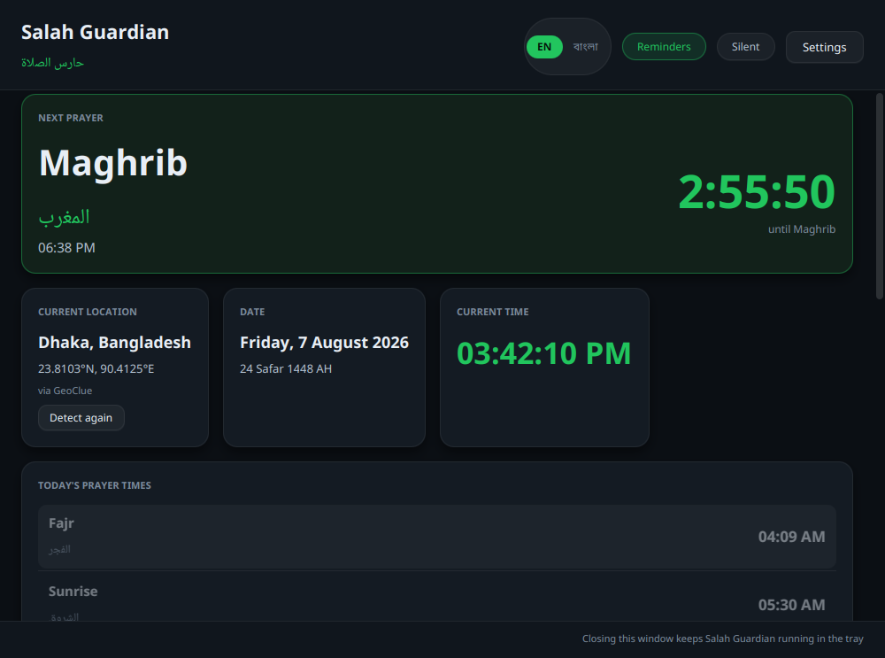
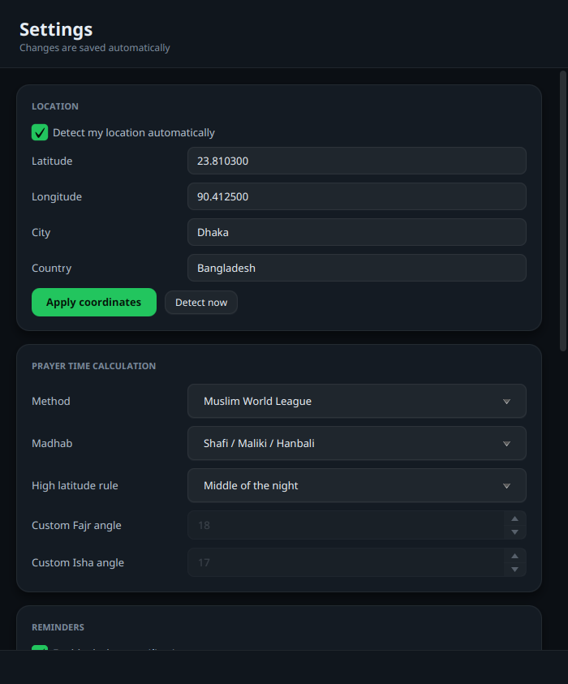
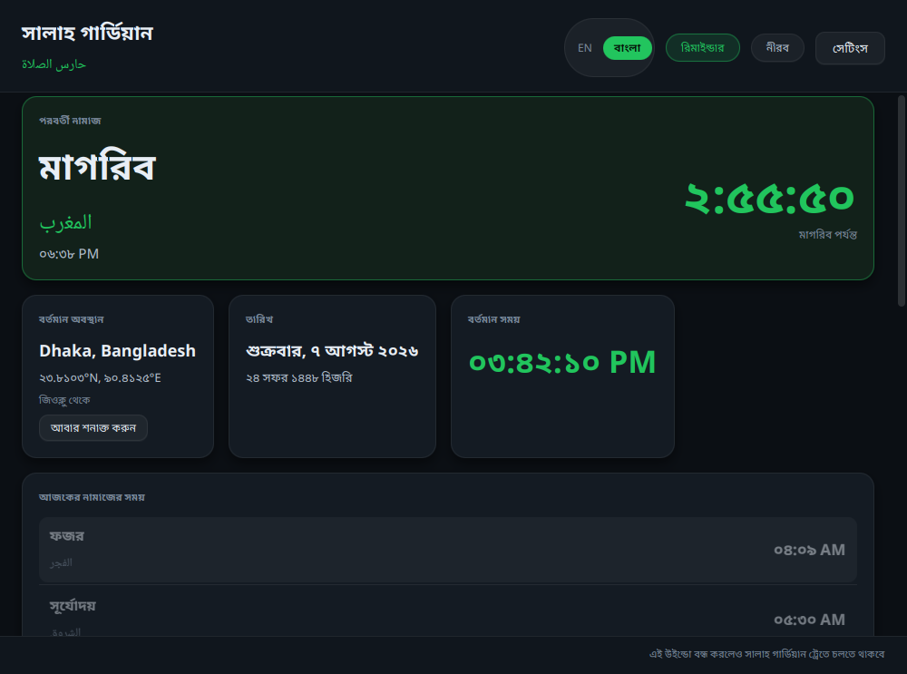
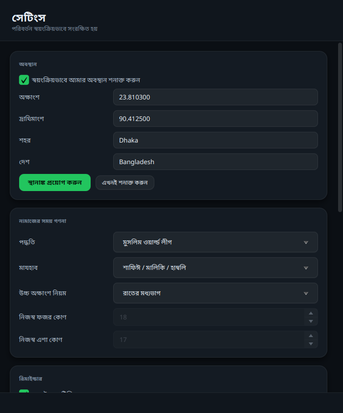
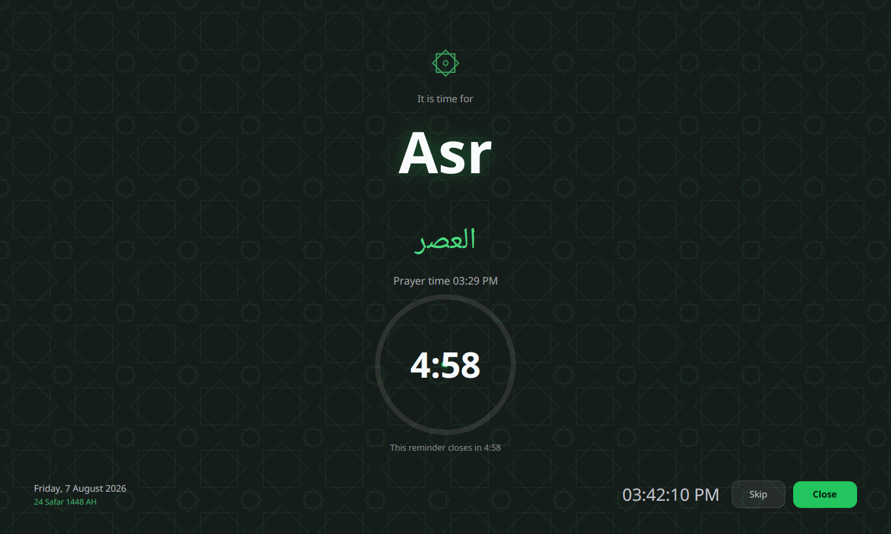
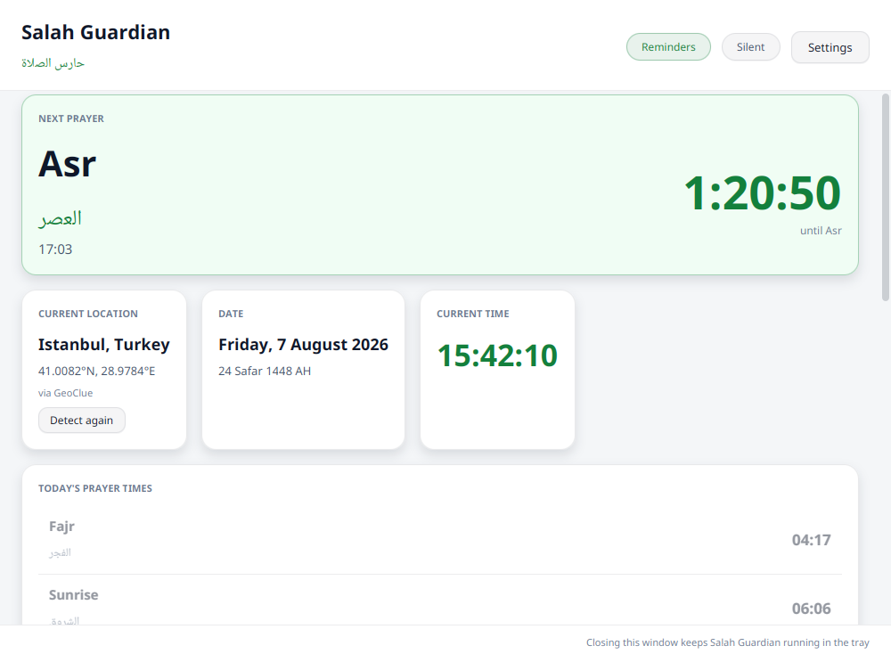
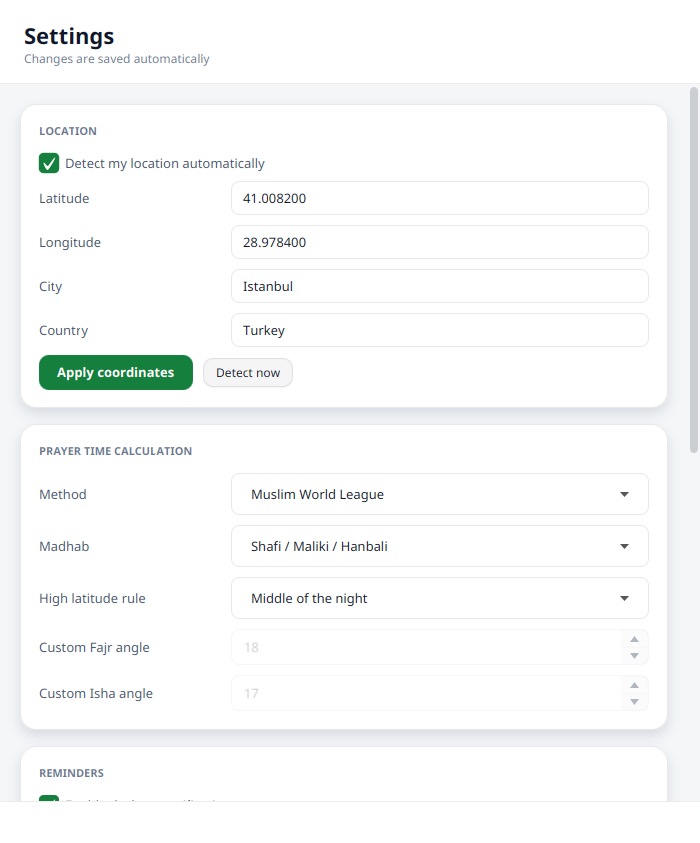

<div align="center">


# Salah Guardian

**A prayer time reminder for the Linux desktop.**

Detects where you are, calculates the five daily prayers for that place, and reminds you
before each one — quietly, on time, and without needing the internet after the first run.

[](https://openjdk.org/projects/jdk/21/)
[](https://openjfx.io/)
[](https://gradle.org/)
[](LICENSE)

</div>

---

## Screenshots

| Dashboard | Settings |
|---|---|
|  |  |

**বাংলা** — switch with the **EN / বাংলা** toggle in the header; the whole interface follows, including prayer names, dates and Bengali numerals:

| ড্যাশবোর্ড | সেটিংস |
|---|---|
|  |  |

**Prayer Focus Mode** — a fullscreen, always-on-top reminder at prayer time:



A light theme is included as well:

| Dashboard (light) | Settings (light) |
|---|---|
|  |  |

> These are real renders of the application's own scene graph, not drawings.
> They are produced by snapshotting the live `DashboardView`, `SettingsView` and
> `FocusOverlayView`.

---

## What it does

| | |
|---|---|
| 📍 **Finds you automatically** | GeoClue via D-Bus first, then IP geolocation, then whatever you saved. Works offline forever after the first success. |
| 🕌 **Calculates six daily times** | Fajr, Sunrise, Dhuhr, Asr, Maghrib, Isha — via [adhan-java](https://github.com/batoulapps/adhan-java). |
| 📐 **Twelve conventions** | Muslim World League, ISNA, Umm al-Qura, Egypt, Karachi, **Turkey (Diyanet)**, Dubai, Qatar, Kuwait, Singapore, Moonsighting Committee, plus **custom angles**. |
| ⚖️ **Shafi and Hanafi** | The madhab moves Asr and nothing else. |
| 🔔 **Two reminders per prayer** | *"🕌 Asr prayer starts in 5 minutes."* then *"🕌 It's time for Asr."* Delivered through libnotify. No audio. |
| 🖥️ **Prayer Focus Mode** | A fullscreen dark overlay with Islamic geometry, a countdown ring, and Skip/Close. Escape and Alt+F4 are ignored. Closes itself after 5 minutes. |
| 📌 **System tray** | Dashboard, today's times, reminder toggles, settings, exit. |
| 🌙 **Hijri, Ramadan, Jumu'ah** | Hijri date on every screen, suhoor/iftar reminders in Ramadan, a Friday morning Jumu'ah reminder. |
| 🔇 **Silent mode** | Mute everything without losing your settings. |
| 🚀 **Start on login** | A standard freedesktop autostart entry. |
| 🌐 **English and Bengali** | One click in the header switches the whole interface — prayer names, dates, notifications, tray menu and settings — with optional Bengali numerals (১২:০৫). Follows your system language by default. |
| 🕐 **12 or 24 hour clock** | 12 hour by default, switchable in Settings. |
| 🎨 **Three themes** | Dark (default), Light, Midnight. Green accent, rounded corners, Arabic-aware typography. |

### Runs on

Ubuntu · Linux Mint · Debian · Fedora · openSUSE · Arch · and any distribution that
can run a JVM. GNOME, KDE Plasma, XFCE, Cinnamon, MATE and LXQt are all supported,
on both X11 and Wayland.

---

## Install

**Debian, Ubuntu, Linux Mint, Pop!\_OS**

```bash
sudo apt install ./salah-guardian_1.0.0_amd64.deb
```

**Fedora, RHEL, openSUSE**

```bash
sudo dnf install ./salah-guardian-1.0.0-1.x86_64.rpm
```

**Anything else** (Arch, NixOS, Slackware, or a no-root install)

```bash
./gradlew jpackageAppImage
./packaging/install.sh          # system wide
./packaging/install.sh --user   # into ~/.local, no sudo
```

Nothing else is required — the package bundles its own Java runtime.
Full details, including the one optional dependency, are in
**[docs/INSTALL.md](docs/INSTALL.md)**.

---

## Build from source

```bash
git clone <repository-url> salah-guardian
cd salah-guardian
./gradlew build           # compile + run the 185 unit tests
./gradlew run             # launch it
./gradlew jpackageDeb     # or jpackageRpm / jpackageAppImage
```

Requires **JDK 21**. Everything else is downloaded by Gradle.
See **[docs/BUILD.md](docs/BUILD.md)**.

---

## Documentation

| Document | What's in it |
|---|---|
| **[docs/INSTALL.md](docs/INSTALL.md)** | Per-distribution install steps, dependencies, troubleshooting |
| **[docs/BUILD.md](docs/BUILD.md)** | Toolchain setup, every Gradle task, packaging internals |
| **[docs/USER_MANUAL.md](docs/USER_MANUAL.md)** | Every screen, every setting, every reminder explained |
| **[docs/ARCHITECTURE.md](docs/ARCHITECTURE.md)** | Architecture, class and sequence diagrams; design decisions |

---

## How it is put together

```
src/main/java/com/ctrends/salahguardian/
├── Launcher.java            process entry point (keeps JavaFX off the module path)
├── SalahGuardianApp.java    JavaFX Application, builds the Guice injector
├── config/                  AppConfig, ConfigService, JSON persistence, paths, themes
├── controller/              ApplicationController, FocusModeController
├── di/                      Guice bindings
├── i18n/                    Language enum + Messages bundle lookup
├── location/                LocationProvider chain: GeoClue → IP → manual/cached
├── model/                   immutable domain types (records and enums)
├── notification/            libnotify → tray balloon → log fallback chain
├── prayer/                  adhan-java calculator, settings snapshot, schedule cache
├── service/                 scheduler, reminder planner, autostart
├── utils/                   time, process execution, desktop detection, logging setup
├── view/                    DashboardView, SettingsView, FocusOverlayView, tray
└── viewmodel/               MVVM view models exposing JavaFX properties
```

**MVVM throughout.** Views only lay out and bind. View models hold observable state
and never touch a `Stage`. Services know nothing about JavaFX. That separation is why
the entire calculation, scheduling, configuration and location stack is unit tested
without a display server.

---

## Where your data lives

| Path | Contents |
|---|---|
| `~/.config/salahguardian/config.json` | Every preference, including your coordinates |
| `~/.local/share/salahguardian/logs/` | Rotating logs: daily, 5 MB cap, 14 days, gzipped |
| `~/.config/autostart/salah-guardian.desktop` | Only if "Start on login" is enabled |

Nothing is sent anywhere. The single outbound request is the IP geolocation lookup,
and only until a location has been stored once.
`XDG_CONFIG_HOME` and `XDG_DATA_HOME` are honoured if set.

---

## Accuracy

Prayer times come from [adhan-java](https://github.com/batoulapps/adhan-java), a
well-established implementation of the standard astronomical algorithms. They are
computed for your exact coordinates, so they may differ by a minute or two from a
timetable printed for your city centre. Use **Settings → Prayer time calculation** to
match your local mosque's convention, and the per-prayer minute offsets in
`config.json` for fine adjustment.

Inside the polar circles there are days with no astronomical twilight at all. Salah
Guardian then falls back to the *nearest latitude* (`aqrab al-bilad`) convention at 45°
and says so on the dashboard rather than showing an empty timetable.

---

## Licence

MIT — see [LICENSE](LICENSE).

Prayer times by [adhan-java](https://github.com/batoulapps/adhan-java) (MIT).
