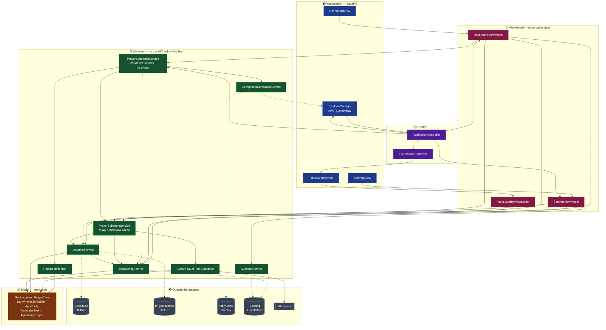
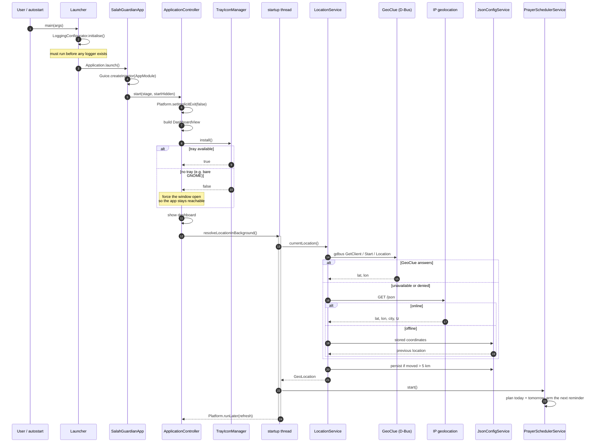
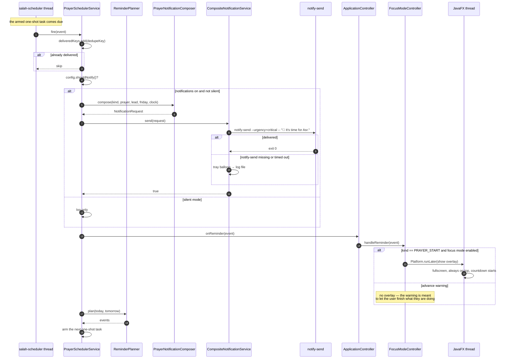
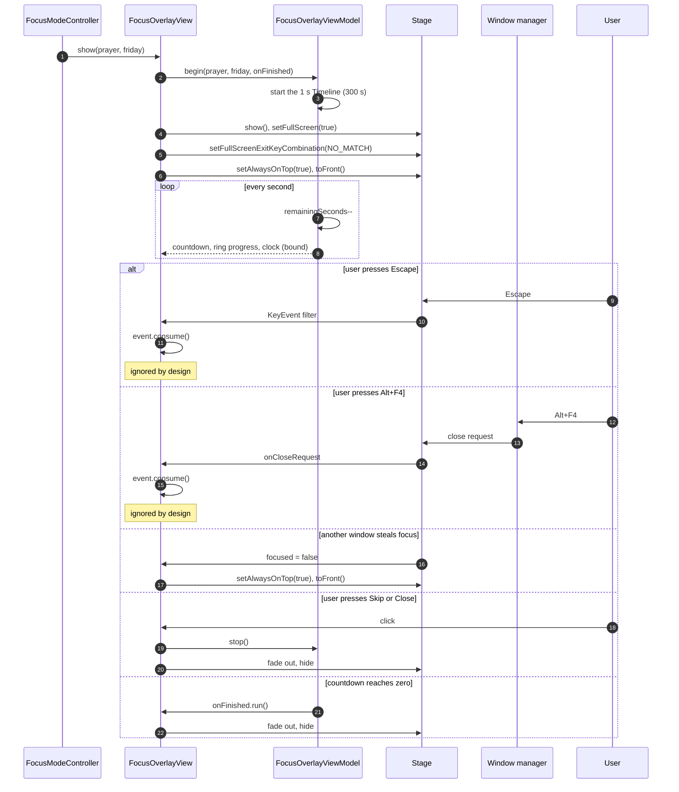

# Architecture

Salah Guardian is an MVVM JavaFX application with a strictly layered core. This
document explains the structure, the diagrams, and the decisions that shaped them.

---

## 1. Architecture overview

Four layers, with dependencies pointing in one direction only — downwards. The view
layer knows about view models; view models know about services; services know about the
model. Nothing below the view layer imports JavaFX except the view models, which use
its property types deliberately.

**Why the layering is worth the ceremony.** Because no service imports JavaFX, the
entire calculation, scheduling, configuration and location stack is unit tested with a
plain JUnit run — no display server, no toolkit initialisation, no flakiness. That is
the practical payoff of the rule, and it is why the suite runs in about four seconds.

---

## 2. Class diagram

Interfaces and their implementations, with the relationships that matter.

```mermaid
classDiagram
    direction TB

    class LocationProvider {
        <<interface>>
        +source() LocationSource
        +isAvailable() boolean
        +resolve() Optional~GeoLocation~
    }
    class GeoClueLocationProvider {
        -gdbus subprocess
        +resolve() Optional~GeoLocation~
    }
    class IpGeolocationProvider {
        -HttpClient
        +parse(body, endpoint) Optional~GeoLocation~
    }
    class ManualLocationProvider {
        +resolve() Optional~GeoLocation~
    }
    class LocationService {
        -List~LocationProvider~ providers
        -AtomicReference~GeoLocation~ current
        +currentLocation() GeoLocation
        +refresh() GeoLocation
        +setManualLocation(...) GeoLocation
    }

    LocationProvider <|.. GeoClueLocationProvider
    LocationProvider <|.. IpGeolocationProvider
    LocationProvider <|.. ManualLocationProvider
    LocationService o-- LocationProvider : ordered chain

    class PrayerTimeCalculator {
        <<interface>>
        +calculate(location, date, zone, settings) DailyPrayerSchedule
    }
    class AdhanPrayerTimeCalculator {
        -POLAR_THRESHOLD 48.0
        -NEAREST_USABLE_LATITUDE 45.0
        -computeAt(...) DailyPrayerSchedule
    }
    class PrayerScheduleService {
        -CacheKey cachedKey
        +today() DailyPrayerSchedule
        +tomorrow() DailyPrayerSchedule
        +nextPrayer() Optional~UpcomingPrayer~
        +invalidate()
    }

    PrayerTimeCalculator <|.. AdhanPrayerTimeCalculator
    PrayerScheduleService --> PrayerTimeCalculator
    PrayerScheduleService --> LocationService

    class NotificationService {
        <<interface>>
        +isAvailable() boolean
        +send(request) boolean
        +describe() String
    }
    class LibNotifyNotificationService
    class TrayNotificationService
    class LoggingNotificationService
    class CompositeNotificationService {
        -List~NotificationService~ backends
    }

    NotificationService <|.. LibNotifyNotificationService
    NotificationService <|.. TrayNotificationService
    NotificationService <|.. LoggingNotificationService
    NotificationService <|.. CompositeNotificationService
    CompositeNotificationService o-- NotificationService : fallback chain

    class ConfigService {
        <<interface>>
        +get() AppConfig
        +update(mutation)
        +save()
        +addChangeListener(listener)
    }
    class JsonConfigService {
        -Path configFile
        -atomic write via .tmp + move
    }
    ConfigService <|.. JsonConfigService

    class PrayerSchedulerService {
        -ScheduledFuture pendingReminder
        -ScheduledFuture watchdog
        -Set~String~ deliveredKeys
        +start()
        +reschedule()
        -fire(event)
        -runWatchdog()
    }
    class ReminderPlanner {
        +plan(schedule, config) List~ReminderEvent~
        +pendingAfter(events, now) List~ReminderEvent~
    }
    class PrayerEventListener {
        <<interface>>
        +onReminder(event)
        +onScheduleChanged()
    }

    PrayerSchedulerService --> ReminderPlanner
    PrayerSchedulerService --> PrayerScheduleService
    PrayerSchedulerService --> NotificationService
    PrayerSchedulerService --> ConfigService
    PrayerSchedulerService ..> PrayerEventListener : notifies

    class ApplicationController
    class FocusModeController
    class DashboardViewModel
    PrayerEventListener <|.. ApplicationController
    PrayerEventListener <|.. DashboardViewModel
    ApplicationController --> FocusModeController
    ApplicationController --> PrayerSchedulerService

    class DailyPrayerSchedule {
        -LocalDate date
        -Map~PrayerName,PrayerTime~ times
        -boolean approximated
        +nextAfter(reference, includeSunrise)
        +currentAt(reference)
        +isComplete() boolean
    }
    class PrayerTime {
        <<record>>
        +PrayerName name
        +ZonedDateTime time
    }
    class GeoLocation {
        <<record>>
        +double latitude
        +double longitude
        +distanceKmTo(other) double
    }
    class ReminderEvent {
        <<record>>
        +ReminderKind kind
        +ZonedDateTime fireAt
        +dedupeKey() String
    }

    DailyPrayerSchedule o-- PrayerTime
    DailyPrayerSchedule --> GeoLocation
    ReminderEvent --> PrayerTime
```

---

## 3. Sequence diagrams

### 3.1 Start-up

The first paint must not wait on the network, so location resolution is pushed onto a
background thread and the scheduler starts only once a position is known.

### 3.2 A reminder firing

One armed task at a time: when it fires it delivers, then re-arms. The dedupe key is
added **before** delivery, so a reschedule triggered by the delivery itself cannot
double-fire the same reminder.

### 3.3 The focus overlay's lifetime

---

## 4. Threading model

Four kinds of thread, with one rule: **anything that can block stays off the JavaFX
thread, and anything that touches a control stays on it.**

| Thread | Owner | Responsibility |
|---|---|---|
| **JavaFX Application Thread** | toolkit | All scene graph and property mutation. Two `Timeline`s run here — the dashboard's one-second refresh and the overlay's countdown. |
| **`salah-scheduler`** | `PrayerSchedulerService` | One daemon thread at `NORM_PRIORITY - 1`. Holds the armed reminder and the watchdog. Listener callbacks arrive here and marshal onward with `Platform.runLater`. |
| **`salah-startup` / `dashboard-background` / `settings-background`** | controllers and view models | Single-thread executors for location resolution, which performs D-Bus and HTTP I/O. |
| **`process-stream-collector`** | `ProcessRunner` | Short-lived daemon threads draining a subprocess's stdout and stderr so a chatty child cannot deadlock on a full pipe. |

Shared state is guarded explicitly: `JsonConfigService` synchronises on a lock and
publishes through a `volatile` field, `PrayerScheduleService` guards its cache,
`PrayerSchedulerService` guards its futures, and listener lists are
`CopyOnWriteArrayList`.

---

## 5. Design decisions

### Why an overlay instead of locking the screen

Locking would need a privileged helper, and every desktop implements it differently —
`loginctl`, `gnome-screensaver`, `xdg-screensaver`, `qdbus` — with different failure
modes and no way to guarantee the user can get back in. A fullscreen always-on-top
window is portable, needs no privileges, cannot lock anyone out, and is still firm:
Escape and Alt+F4 are ignored, and it re-raises itself when it loses focus.

### Why `gdbus` and `notify-send` rather than D-Bus bindings

A native Java D-Bus binding means JNI or a large pure-Java stack, and it still fails on
machines without a session bus. `gdbus` is part of glib2 and `notify-send` part of
libnotify — both present wherever GeoClue and desktop notifications exist. Driving them
as subprocesses costs one `fork` per call, keeps the dependency footprint at zero, and
behaves identically on GNOME, KDE, XFCE, Cinnamon and MATE. `ProcessRunner` bounds every
call with a timeout and drains both streams, so a hung daemon cannot stall the scheduler.

### Why one armed task plus a watchdog

Parking a task on every reminder of the day would make a settings change fiddly and the
executor queue large. Arming only the next one keeps both trivial. But a one-shot task
alone is not enough on a laptop: suspending the machine stops the monotonic clock the
executor uses, so a task due at 17:00 fires late by however long the lid was closed.
A watchdog therefore runs every 30 seconds and re-plans when it sees the wall clock jump
by more than 90 seconds, the date roll over, or the armed task vanish. Reminders missed
while asleep are still delivered if less than two minutes stale, and dropped otherwise —
waking to six hours of backdated prayer notifications helps nobody.

### Why the view is built in code rather than FXML

An FXML file is a runtime resource that can fail to load, and the failure surfaces as an
exception at window-open time on a user's machine rather than as a compile error on the
developer's. For an application that has to behave identically inside a jpackage image
on six distributions, a scene graph the compiler has already checked is the safer
trade. Styling still lives entirely in CSS, so the look is as editable as it would be
with FXML.

### Why `Theme` maps to whole stylesheets

JavaFX resolves looked-up colours (`-sg-accent` and friends) at the `.root` level.
Defining the structure once in `base.css` and only the palette in each theme means a
theme change is a one-line swap of the scene's stylesheet list, and a new theme is
roughly thirty lines of colour definitions.

### The two adhan-java quirks that shaped the calculator

1. **Millisecond leakage.** `CalendarUtil.resolveTime` does not clear the millisecond
   field, so the current wall clock leaks into every returned `Date`. Two calculations of
   the same day would differ by a few milliseconds, and reminders would fire a fraction
   of a second off. The calculator truncates to whole minutes.
2. **Empty polar days.** Where the sun never crosses the twilight angles, adhan returns
   `null` for *every* time — not just Fajr and Isha. Left alone that means a blank
   timetable and no reminders for weeks. The calculator detects an incomplete day beyond
   48° and recomputes at the nearest usable latitude (45°), flagging the result so the
   dashboard can say the times are a convention rather than an observation.

### Graceful degradation, everywhere

Every external dependency has a defined answer for "what if it is not there":

| Missing | Consequence |
|---|---|
| GeoClue | IP geolocation, then the stored location |
| Internet | The stored location; everything else works offline |
| Any location at all | Makkah, with a prompt to set one in Settings |
| `notify-send` | Tray balloon, then the log file — a reminder is never lost |
| System tray | The dashboard window stays open so the app is reachable |
| Writable home directory | Settings live in memory, the app keeps running |
| Valid `config.json` | The bad file is quarantined and defaults are used |
| Twilight at this latitude | Nearest-latitude approximation, clearly labelled |

---

## 6. Configuration schema

`~/.config/salahguardian/config.json`, written atomically via a `.tmp` file and a move.

| Field | Type | Default | Meaning |
|---|---|---|---|
| `schemaVersion` | int | `1` | Document version, for future migrations |
| `latitude`, `longitude` | double | Makkah | Position used for the calculation |
| `city`, `country`, `timeZoneId` | string | `""` | Labels and the zone times are shown in |
| `locationSource` | enum | `MANUAL` | `GEOCLUE`, `IP_GEOLOCATION`, `MANUAL`, `CACHED` |
| `locationResolvedAtEpochSecond` | long | `0` | Non-zero means a location has been stored |
| `autoDetectLocation` | bool | `true` | Off pins the coordinates you entered |
| `calculationMethod` | enum | `MUSLIM_WORLD_LEAGUE` | One of the twelve conventions |
| `madhab` | enum | `SHAFI` | `SHAFI` or `HANAFI`; affects Asr only |
| `highLatitudeRule` | enum | `MIDDLE_OF_THE_NIGHT` | Polar region strategy |
| `customFajrAngle`, `customIshaAngle` | double | `18.0`, `17.0` | Used by the `CUSTOM` method |
| `manualAdjustments` | int[6] | zeros | Per-prayer offsets in minutes |
| `notificationsEnabled` | bool | `true` | Master switch for reminders |
| `reminderMinutes` | int | `5` | Advance warning lead; `0` disables it |
| `remindAtPrayerTime` | bool | `true` | The reminder at the prayer itself |
| `silentMode` | bool | `false` | Mutes everything without losing preferences |
| `fridayReminderEnabled`, `fridayReminderHour` | bool, int | `true`, `9` | Jumu'ah reminder |
| `ramadanRemindersEnabled` | bool | `true` | Suhoor and iftar |
| `focusModeEnabled` | bool | `true` | The fullscreen overlay |
| `focusDurationSeconds` | int | `300` | How long it stays up |
| `theme` | enum | `DARK` | `DARK`, `LIGHT`, `MIDNIGHT` |
| `use24HourClock` | bool | `true` | Clock format everywhere |
| `startOnLogin` | bool | `false` | Mirrors the autostart entry on disk |
| `startMinimisedToTray` | bool | `true` | Applies to `--minimised` launches |
| `showHijriDate` | bool | `true` | Hijri date on the dashboard |

`AppConfig.normalise()` clamps every value on load and before every save, so neither a
hand-edited file nor a bug can leave the application in an unusable state.
